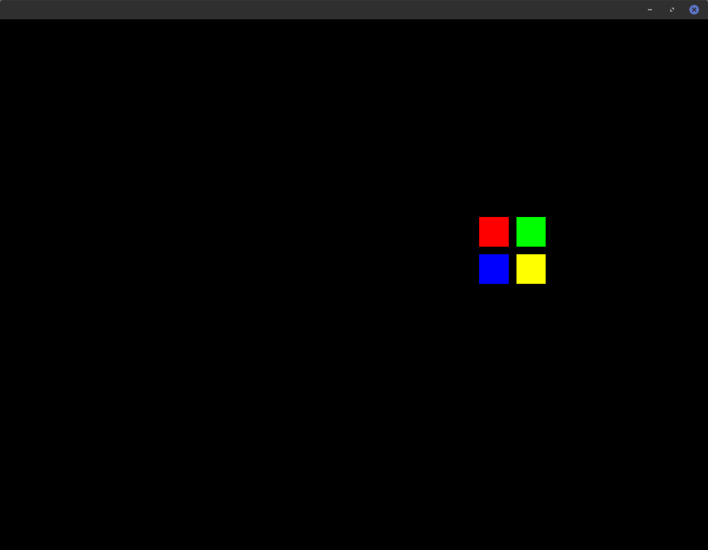

[](https://github.com/thebigG/shaders/actions/workflows/build.yaml)
# shaders
This repo is meant to be a source of reference for shaders examples to help guide future shader efforts (e.g. games.). Below is a list of some examples that stand out that might be helpful shader reference/documentation for the future.

# Some Examples
1. [HUD](#HUD)
2. [Company Logo](#company_logo)
3. [Flowers](#flowers)
4. [husukai_no_wave](#husukai_no_wave)

## HUD <a name="HUD"></a>
- [HUD](shaders/examples/bin/data/shadersGL2/hud_lygia.frag)
This HUD is a replication of this [HUD](https://www.shadertoy.com/view/4s2SRt) with some modifications and it is drawn using [lygia](https://lygia.xyz/)


## Company Logo <a name="company_logo"></a>
- [Company Logo](shaders/examples/bin/data/shadersGL2/polar_shape_polygon.frag)
This shader is a simple company logo of a computer company that demos an easy distance field. It does not use lygia.


## Flowers <a name="flowers"></a>
- This  is a simple example of tiles and it is drawn using [lygia](https://lygia.xyz/)


## Husukai No Wave <a name="husukai_no_wave"></a>
- This  is a simple example of inverting colors in textures.  
Inverted  

Original


## Building OpenFrameworks
```
git submodule update --init --recursive
cd openFrameworks/scripts/linux
./download_libs.sh
cd ubuntu
sudo ./install_dependencies.sh
cd ..
./compileOF.sh -j4
projectGenerator -o  apps/myApps/newExample
```

## Build shaders project
```
make -j4
make RunRelease
```


NOTE:Remember to add "export PG_OF_PATH=/home/lgomez/shaders/openFrameworks" to bashrc/zshrc.
